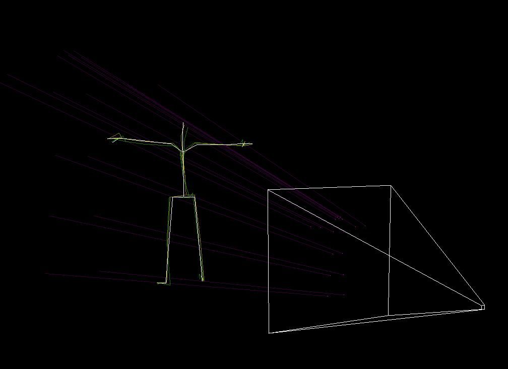
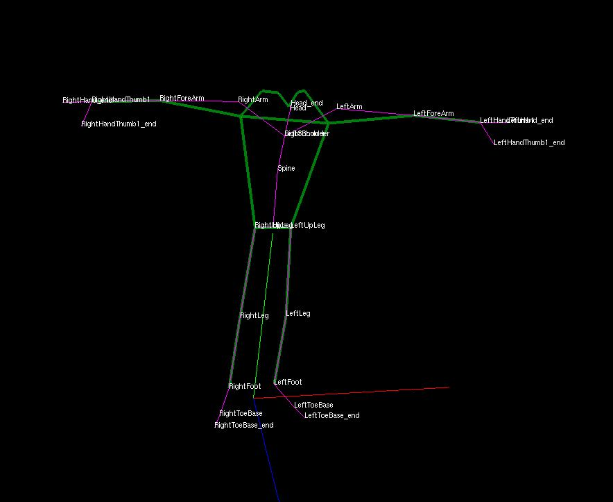

```meta
title: Diffusion Model For Human Poses
date: 2023/03/31
tags: AI, neural-network, pytorch, diffusion-model, programming
```
# Diffusion Models

Diffusion models and denoising score matching models have gained notoriety because of the awesome models that can generate images based on text descriptions.

While other techniques in generative modelling use random numbers or add noise to inputs, the defining characteristics of diffusion models are that they make multiple steps and that the level of noise being added to an input is itself an input to the network. This lets diffusion models reason about the current state, and how to alter the state for the next step. This helps the model work well in both regions of low support from the dataset and in regions with high support. The areas with low support typically have smooth gradients, while the areas with high support typically have high-frequency, sharp, and detailed gradients. [This blog post](https://yang-song.net/blog/2021/score/) is an excellent introduction. I'll be much less rigorous.

Diffusion processes have real data at time `t=0`, and perturb it to look completely random at `t=1`, typically having the same shape (e.g. image size is constant).
The "forward" diffusion process is the stochastic process of going from real to random data: `t :: 0 -> 1`.
The "reverse" process uses the learned model to reverse the chain. We make lots of small steps, each adding the predicted offset (and possibly new noise) to the state to get the next state.

There's lots of options for how to carry out both processes. It is most intuitive to have a continuous set of timesteps: any number `t` in the range [0,1] is okay.
For the forward process, we can add Gaussian noise to our input with sigma values that are exponentially interpolated from \(\sigma_0\) to \(\sigma_1\). Let's call this function \(\mathcal{T}\), it goes \(\mathcal{T}(t) = \sigma_0 \cdot \left[ \frac{\sigma_1}{\sigma_0} \right] ^t\)
For the reverse process, we can add the output of our model with a fraction of the level of noise.

We add noise the in the reverse process to improve the diversity of generated samples. It is better than only relying the randomness from the initial state, since mulitple trajectories starting at different initial states could converge if the model squeezes the space.


### Training
Diffusion/DSM models can be trained like denoising autoencoders. In fact outside of the diffusion process that is almost exactly what they are. The [original denoising AE paper](https://www.cs.toronto.edu/~larocheh/publications/icml-2008-denoising-autoencoders.pdf) has a section "Manifold Learning Perspective". The addition to a diffusion model (other than the process that goes along with it) is just that it is conditioned on the current step in the process, that is: it's given `t` as in input in some fashion.

Given a dataset of real samples, simply generate random times `t`, add the time to the input of the network in some way, map the [0,1] time to the \(\sigma\) value and add random Gaussian noise \(\eta\) with that standard deviation to the input. The desired output of the network is \(-\eta\). An `l2` or `l1` loss can be used.

> TODO: Have section on the [original Hyvarinen score matching paper](https://www.jmlr.org/papers/volume6/hyvarinen05a/hyvarinen05a.pdf) which has some remarkable facts, and I spent a few days to go through it, before realizing it is actually replaced by denoising autoencoders.

# Estimating Human Poses
I wanted to work with human poses rather than images. Luckily a basic skeleton has around 30 3-dim joints instead of the `3 * 2^16` states for a 256x256 RGB image, so our model can be smaller and easier to train. Also I find the manifold of realistic human poses much, much more tangible than the the manifold of realistic images.

I want to do something a little more complicated than unconditionally generating data. I want to estimate 3d poses *from* 2d observations of the skeleton.

First I had to find a dataset of 3d human poses. I also wanted a joint dataset of 3d poses, and assosciated 2d images. I was going to use the pretrained `torchvision.FasterKeypointRcnn` models to get the 2d keypoints based on the images. Unfortunately, the sole dataset I found would not give me access. Do I really need the 2d images? What if I have only the 3d joint locations, I generate random camera intrinsics/extrinsics, and project the points onto the virtual image plane. That'll give essentially the same data as running the Keypoint RCNN model on 2d images, assuming the model is always accurate.



### Pose Prior Dataset
I stumbled on [the Pose Prior Dataset](https://poseprior.is.tue.mpg.de/index.html). This is pretty much what I needed. One issue is that the skeleton there does not match the skeleton estimated by the pretrained Keypoint RCNN model. No big deal, we just have to take linear combinations of some of the joints before projecting them onto the virtual camera.


The dataset is provided via `.bvh` files. These describe the poses as one hierarchy (joint offsets and relationships), then a bunch of configurations (the Euler angle rotations of the joints).
I found a python library to parse the skeletons and evaluate the configurations to sets of 3d points. I convert the BVH files to a numpy array of just the 3d points. It's this binary file which is actually used by the `torch.Dataset` during training.
I also augment the skeletons when exporting them. This is to add more diversity to the skeletons. For example, some people have longer wing-spans than heights, some shorter. Some people have longer legs than others, etc.

### Models
I tried two kinds of model architectures
 1. Simple fully-connected, with residual connections. The input is simply the flattened and concatted 3d joints (current state) and 2d observations.
 2. Attention based, with residuals. The conditional 2d observations are appended as new tokens in the sequence. The outputs at those sequence positions are dropped.

### Sampling
Most of the resources on diffusion and DSM lost me when talking about the SDE solver. Like, I think I understand, it seems simple. But they really get down in the weeds of the stochastic calculus, variance explosion, the Euler-Maryama... blah blah blah. Maybe that is to get more respect from mathematicians in what has become an empirical field. Or maybe that's needed because of how complicated the manifold of images is, which is what those papers are typically about. But for the smaller state space of human poses, I get away with simple forward and reverse processes.

What we need to do is start with an initial random pose, run a bunch of steps where we slowly walk the state where the model is telling us to, while also introducing randomness. It makes sense to use same time-to-noise function as we did when training, that function \(\mathcal{T}\). However, I multiply it by a coefficient less-than-one to lower the randomness a little bit.

## Results
> Add videos, still more work to do before that though
> Overfitting. Could expand dataset by using the as the authors of the dataset suggest: form rotation occupancy maps conditioned.
> Ad hoc camera intrinsics/extrinsics.
